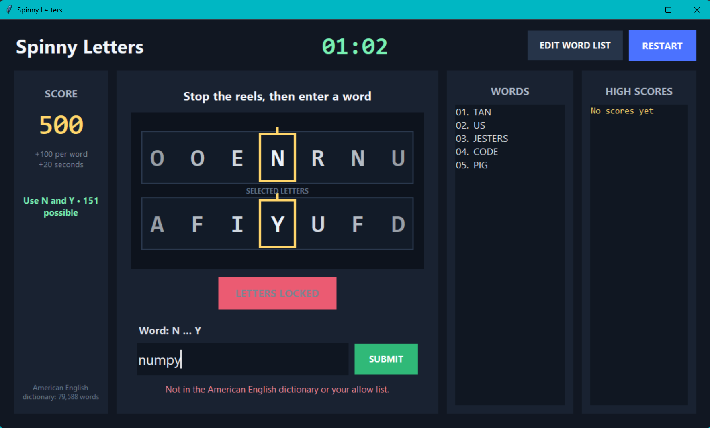

# Spinny Letters

**Spinny Letters** is a fast-paced desktop word game written in Python with Tkinter. Two animated letter reels spin across the screen. Stop them, then enter an American English word that begins with the first selected letter and ends with the second.

<br>

Every correct answer earns points and adds 20 seconds to the clock. Keep playing until time expires, then try to beat your saved high score.

## How to Play

1. Click **Start Game**.
2. Press **Space**, **Enter**, or click **Stop Letters** to begin slowing the reels.
3. Wait for both reels to lock onto their selected letters.
4. Enter a word that starts with the first letter and ends with the second.
5. Press **Enter** or click **Submit**.
6. A valid answer earns 100 points and adds 20 seconds.
7. Continue until the timer reaches zero.

When time expires, Spinny Letters reveals one valid word you could have played for the final letter pair.

## Keyboard Controls

| Key | Action |
| --- | --- |
| `Space` | Stop the reels, or start a new game after time expires |
| `Enter` | Stop the reels, submit a word, or start a new game after time expires |

## Fair Letter Selection

The reels look random, but Spinny Letters guarantees that each selected first-and-last-letter combination has valid words in the active dictionary.

At the beginning of every round, the game:

1. Groups dictionary words by their first and last letters.
2. Chooses a playable letter pair.
3. Selects one secret example word for the round.
4. Animates both reels through random letters.
5. Slows the reels and lands them on the chosen pair.

The secret word does not restrict the player's answer. Any unused valid word matching the selected letters is accepted.

Letter combinations become more challenging as the score increases:

| Score | Preferred minimum available words |
| ---: | ---: |
| 0 to 2,499 | 150 |
| 2,500 to 4,999 | 75 |
| 5,000 to 9,999 | 40 |
| 10,000+ | 15 |

If no pair meets the preferred threshold, the game safely falls back to another playable pair.

## Requirements

- Python 3.10 or newer recommended
- Tkinter, normally included with standard Windows and macOS Python installations
- `cmudict` for American English word validation

Install the dependency:

```bash
py -m pip install -r requirements.txt
```

On systems where `py` is unavailable:

```bash
python -m pip install -r requirements.txt
```

## Run the Game

```bash
py spinny_letters.py
```

Or:

```bash
python spinny_letters.py
```

## Dictionary Validation

Spinny Letters uses CMUdict as its primary American English dictionary. If CMUdict is installed, the status panel displays:

```text
American English dictionary: ON
```

If it is unavailable, the game switches to custom-list-only mode. Install the dependency with:

```bash
py -m pip install cmudict
```

CMUdict is primarily a pronunciation dictionary, so it can contain entries that are unusual for a casual word game. The editable override list lets you correct those cases without modifying the Python source.

## Edit Allowed and Blocked Words

Click **Edit Word List** in the game or edit `spinny_letters_wordlist.txt` directly.

Use `+` to explicitly allow a word:

```text
+photoshop
```

Use `-` to explicitly reject a word:

```text
-inum
```

A plain word without a prefix is treated as allowed:

```text
blender
```

Rules for the override file:

- One word per line
- Letters only
- Case-insensitive
- Lines beginning with `#` are comments
- Blocked words override the main dictionary
- Allowed words work even when CMUdict is unavailable
- Changes are reloaded automatically before rounds and validation checks

## Scoring and Timer

- Starting time: 60 seconds
- Correct answer: 100 points
- Correct-answer bonus: 20 seconds
- Duplicate words are rejected during the same game
- The top 10 scores are saved locally

High scores are stored in `spinny_letters_high_scores.json`, which is created automatically beside the Python file.

## Repository Files

```text
spinny-letters/
├── spinny_letters.py
├── spinny_letters_wordlist.txt
├── requirements.txt
├── README.md
└── .gitignore
```

## Notes

The game runs locally and does not download a dictionary automatically. Installing the dependency once provides offline dictionary validation on future launches.
